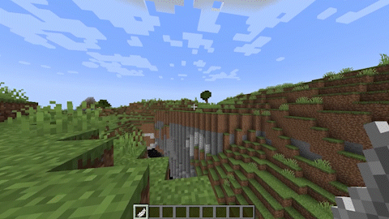

# Minecraft Rainbow Snake Plugin

This is a Spigot plugin for Minecraft `1.19.4` that provides a fun tool called "Rainbow Snake" that can be used in lobbies or in-game for movement with cooldown and configurable snake trail blocks.

## Usage

Run chat command `/snake` to obtain `Rainbow Snake` item, then right-click while in primary hand.

## Configuration

Cooldown duration is located in `UseSnake.java`.
Snake trail blocks can be changed in `SnakeBody.java`.

## Development Instructions

To develop this plugin further, you will need:

- Java Development Kit (JDK) 8 or later
- Apache Maven
- Spigot API

Here are the general steps to build the plugin:

1. Clone the repository: `git clone https://github.com/asheikho99/minecraft-rainbow-snake.git`
2. Build the plugin using Maven: `mvn package`
3. The built plugin will be located in the `target` directory.

Here are some resources for further learning:

- [Spigot Plugin Development tutorial](https://www.spigotmc.org/wiki/spigot-plugin-development/)
- [Bukkit API Javadocs](https://hub.spigotmc.org/javadocs/bukkit/)
- [Spigot API Javadocs](https://hub.spigotmc.org/javadocs/spigot/)

Feel free to contribute to this plugin by submitting pull requests or creating issues.

Let me know if you have any questions or suggestions!
